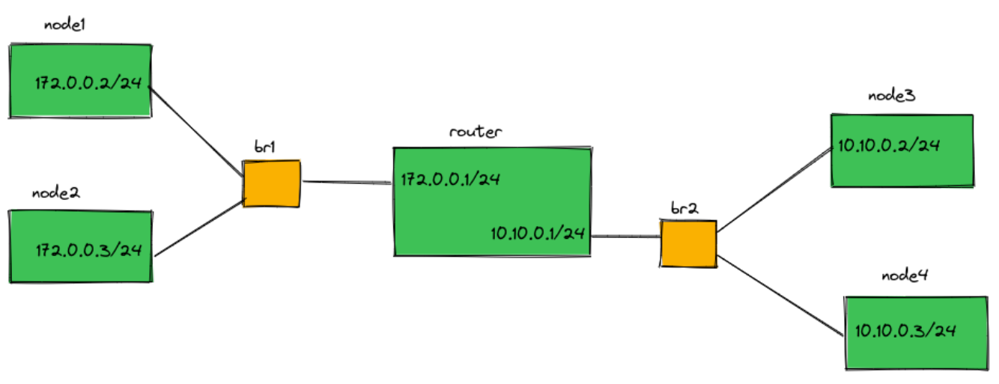
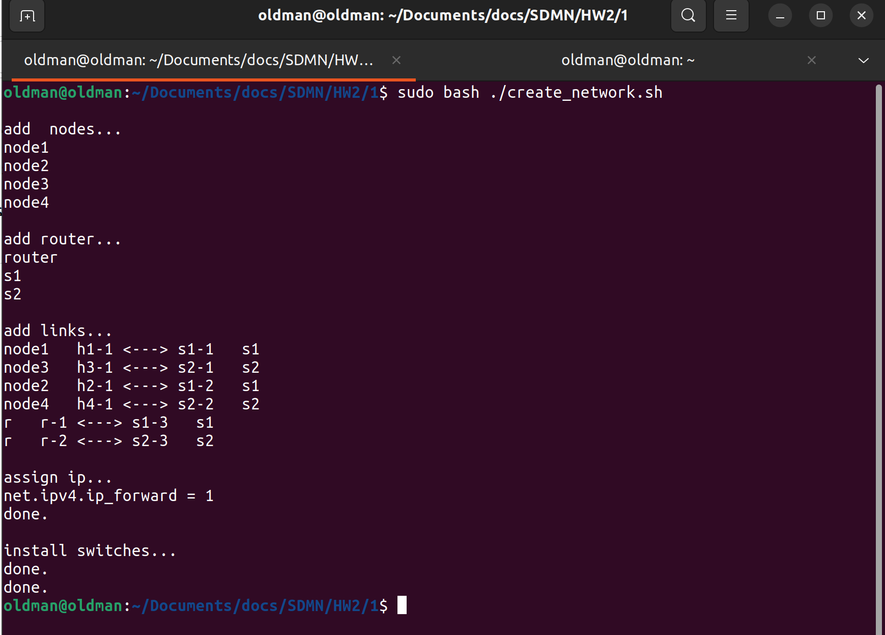
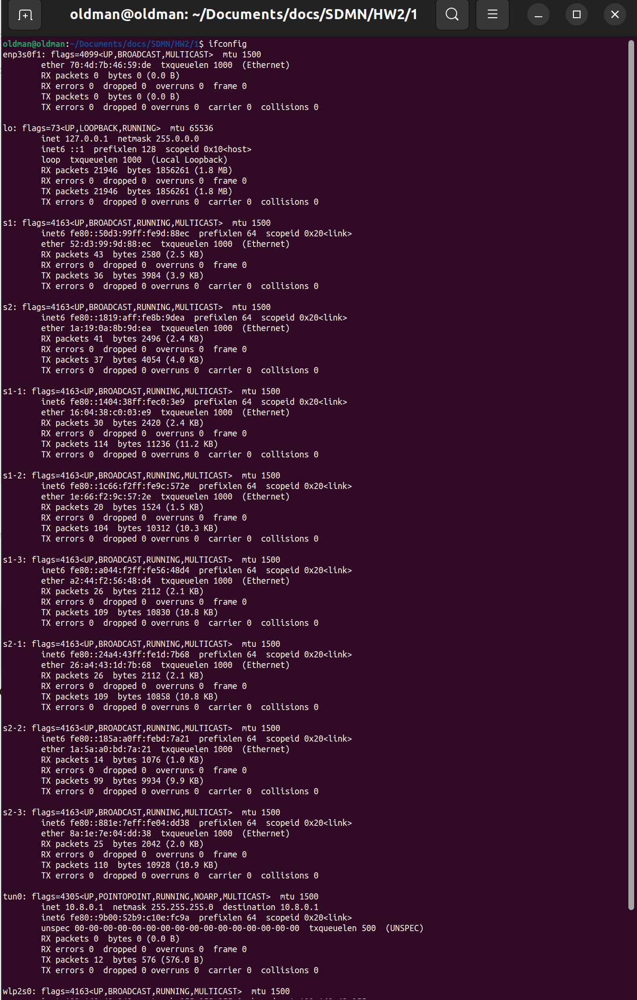
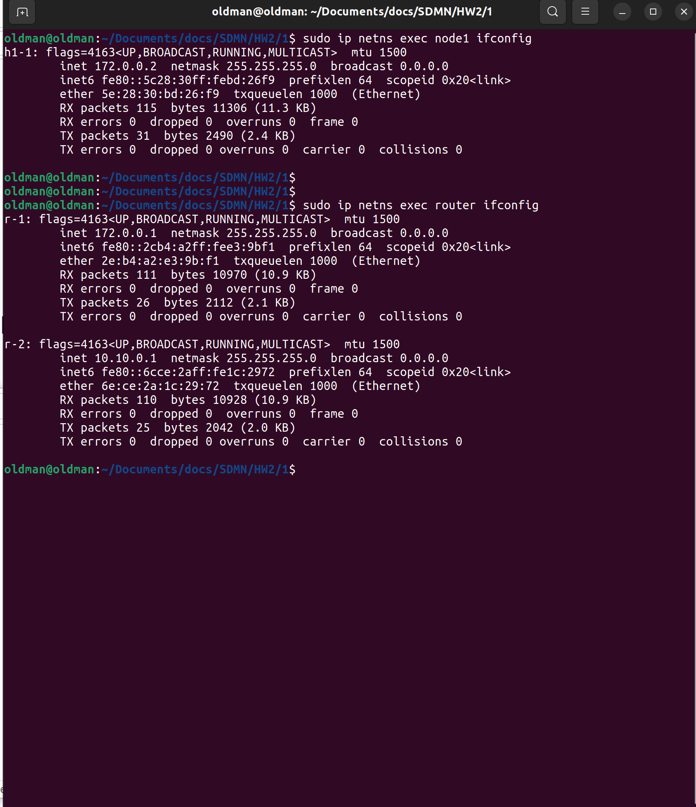
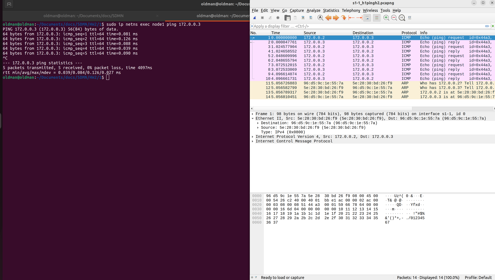
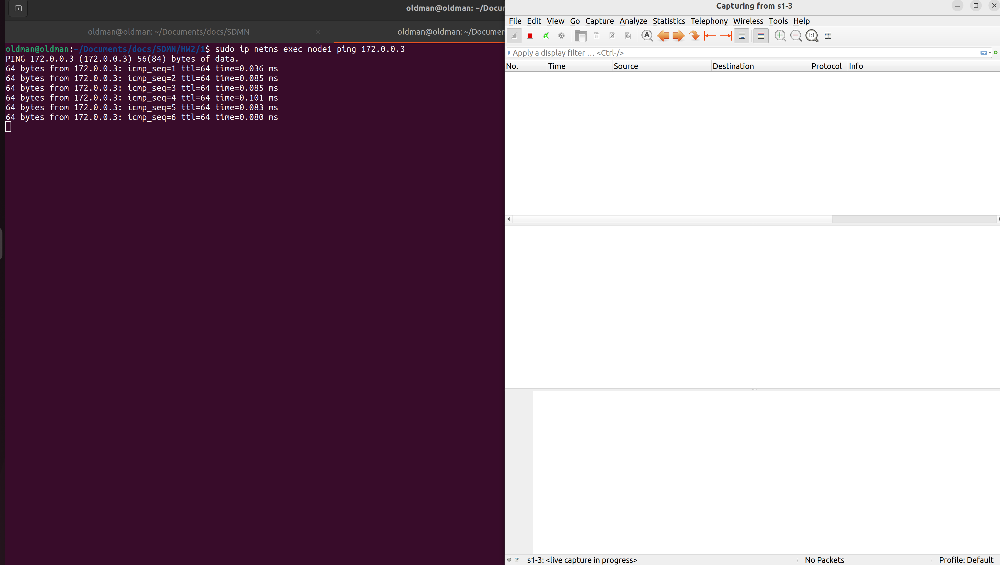
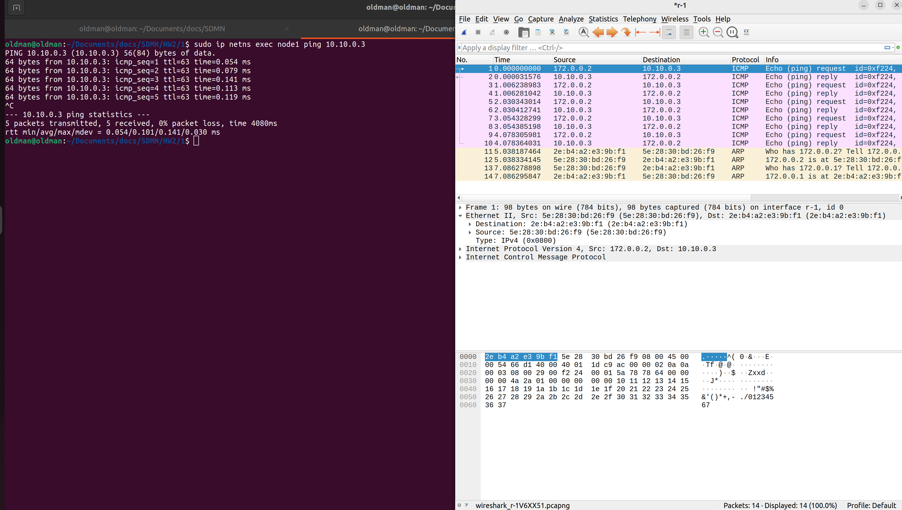
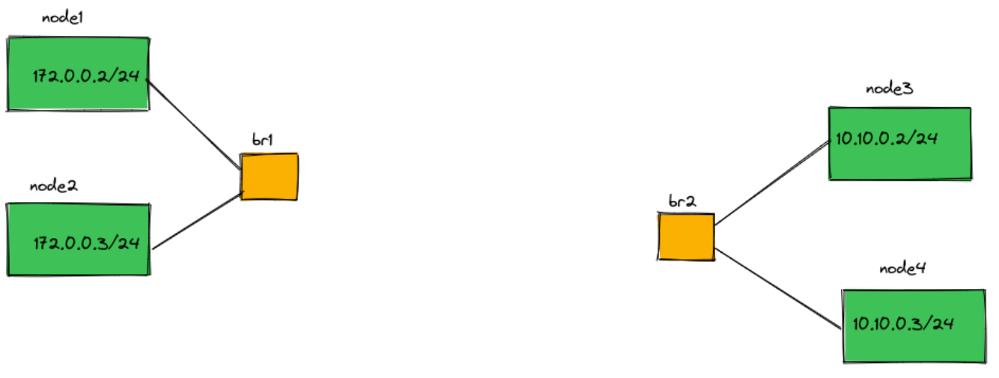
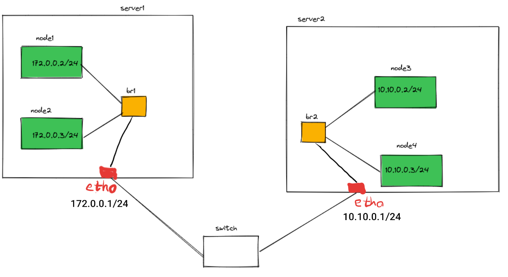

# Problem 1 (Container Networking)

In this problem, we are going to create topology by using separate namespaces.
According to the question, each host has its own network namespace (router included).

Topology: There are four nodes in two subnets. Hosts are connected to switches (which are in the 
root namespace)



## Codes

This section contains three scripts listed below:
- `create_network.sh`: Create network topology (namespaces, switches, and interfaces)
- `clear_network.sh`: Clear all namespaces and interfaces
- `ping.sh`: Use this to test the network

### Implementation

1. create namespaces
```
sudo ip netns add <ns-name>
```

2. create bridges
```
sudo ip link add <br-name> type bridge
```

3. interfaces pair
```
sudo ip link add <inf1> type veth peer name <inf2>
```

4. assign interfaces
```
sudo ip link set <int> netns <ns-name> # hosts/router
sudo ip link set <int> master <br-name> # bridges
```

5. assign ip to interfaces
```
sudo ip netns exec <ns-name> ip addr add <addr>/24 dev <int>
sudo ip netns exec <ns-name> ip link set <int> up
```

6. enable ip forwarding for router
```
sudo ip netns exec router sysctl net.ipv4.ip_forward=1
```

7. bring switches up
```
sudo ip link set <br-name> up
sudo ip link set <br-int> up
```

___

## Images and report

* Check `screenshots` and `pcaps` to see all implementation step results.

<br>
</br>

- #### network's start result:




<br>
</br>

- #### root namespace after adding new interfaces (only interfaces which are not assigned to other namespaces are visible)


<br>
</br>

- #### node1 has only one interface (to s1) and router has two (each for one subnet)



<br>
</br>

- #### packet routes: when h1 ping h2, only s1-1 and s1-2 passes the packet. no packets pass from s-3 (below images)
- #### check `pcaps` for more data




<br>
</br>

- #### packet routes: when h1 ping h4, packets pass from s-3 (below images)
- #### check `pcaps` for more data


## Getting Started

run `create_network.sh` to create the network and then run `ping.sh`
```bash
bash ./create_network.sh
bash ./ping.sh node1 router
```

## Other questions

### 1- Now delete the router and its links to the bridges. How can we route packets from one subnet to another?



* #### we can send packet with these methods:
  * 1- we can use vSwitches (e.g. open-flow) and handle both l2 and l3 operation 
  in them and connect switches to each other
  * 2- route the packets by a root-ns router and connect the switches to the router.
    * create another bridge in the root-ns:
    ```
    sudo ip link add router type bridge
    ```
    * creates interfaces and connect them (same as previous part) and add routing rules:
    ```
    ip route add 172.0.0.0/24 via 172.0.0.1 dev r-node1
    ip route add 10.10.0.0/24 via 10.10.0.1 dev r-node2
    ```

### 2- What if the namespaces are on different servers (virtual machine or physical server) that can see each other in layer 2?



* #### we can do this:
  * assign ip address to each server's physical interface:
  ```
  server1: ip addr add 172.0.0.1/24 dev eth0
  server2: ip addr add 10.0.0.1/24 dev eth0
  ```
  * connect network bridges to the physical interfaces
  * add routing and ip forward rules:
  ```
  server1: ip route add 10.10.0.0/24 via 172.0.0.1 dev eth0
  server2: ip route add 172.0.0.0/24 via 10.10.0.1 dev eth0
  ```