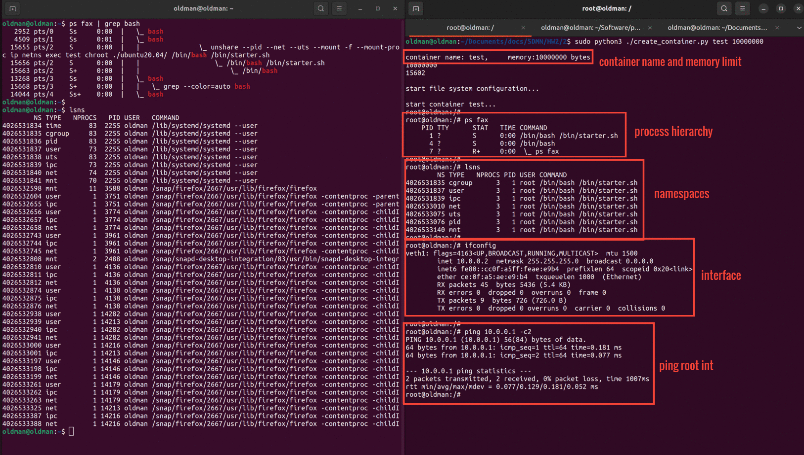
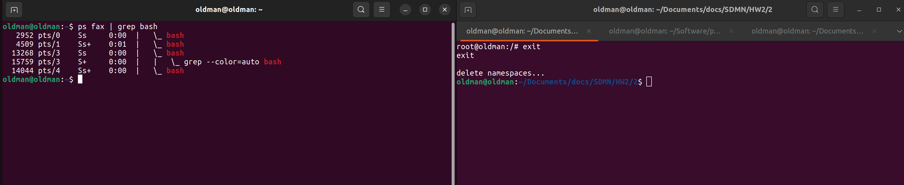
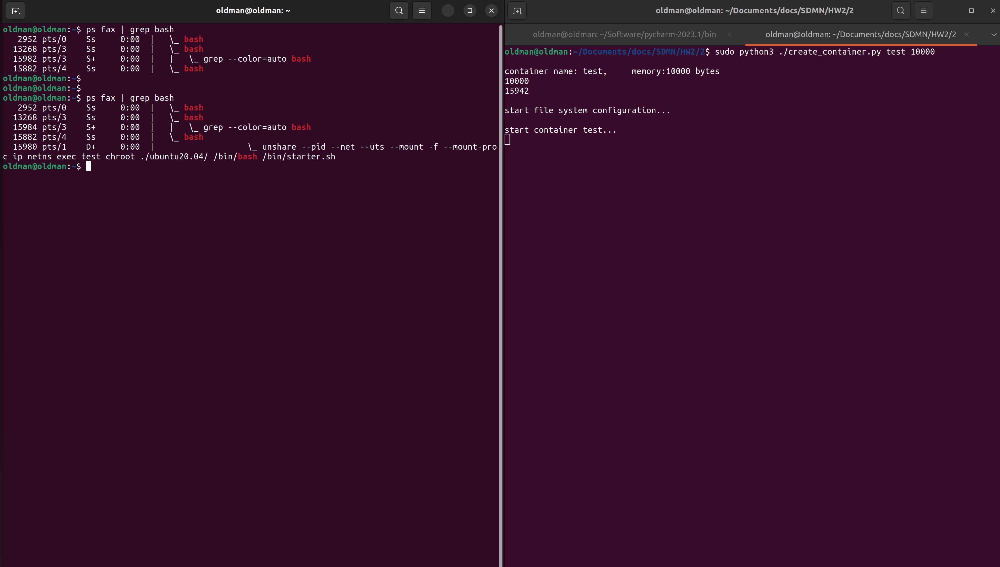
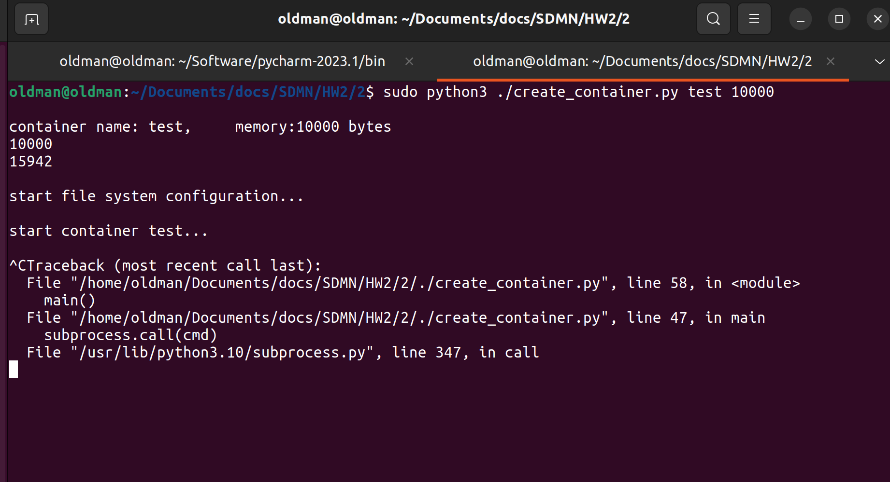

# Problem 2 (Container Runtime)

In this problem, we aim to create a simple version of container with ubuntu file-systems


## Codes

This section contains two scripts listed below:
- `create_container.py`: Install container
- `utils.py`: Utils library
- `install-packages.sh` & `starter.sh`: Move to fs for initial config

### Implementation

* some codes are same as problem 1

1. limit create cgroup (if does not exist) and add the process to it
```
cgroup_config(memory_limit, pid)
```

2. download ubuntu:20.04 (if does not exist) and install necessary packages to test the
container (e.g. net-tool and iputils-ping)
```
init_fs()
```

3. start container env
```
cmd = initial_env_cmd(container)
subprocess.call(cmd)
```

4. clean namespaces and interfaces when container is stopped
```
clean_network_ns(container)
```

___

## Images and report

* Check `screenshots` and `pcaps` to see all implementation step results.

<br>
</br>

- #### network's start result: as we can se, container's (right shell) pids and other name spaces are separate in comparison with root-ns (left shell). And it has only one interface. Also, we can ping root-ns interface
- #### container name is `test` and memory limit is `10 MB` which is sufficient



<br>
</br>

- #### stopping container and cleaning namespaces


<br>
</br>

- #### when we decrease memory limit dramatically to `10 KB` the process takes so long to finish. As we can see in the root-ns (left) shell, we have to wait for a while and then we can see (second `ps fax` command) the container process. Also the process is still running



<br>
</br>

- #### with low memory when we stop the container, it takes so long to finish and it may crash.



## Getting Started

run `create_container.sh` to create a container:
```bash
sudo python3 ./create_container.py myContainer 10000000
```
