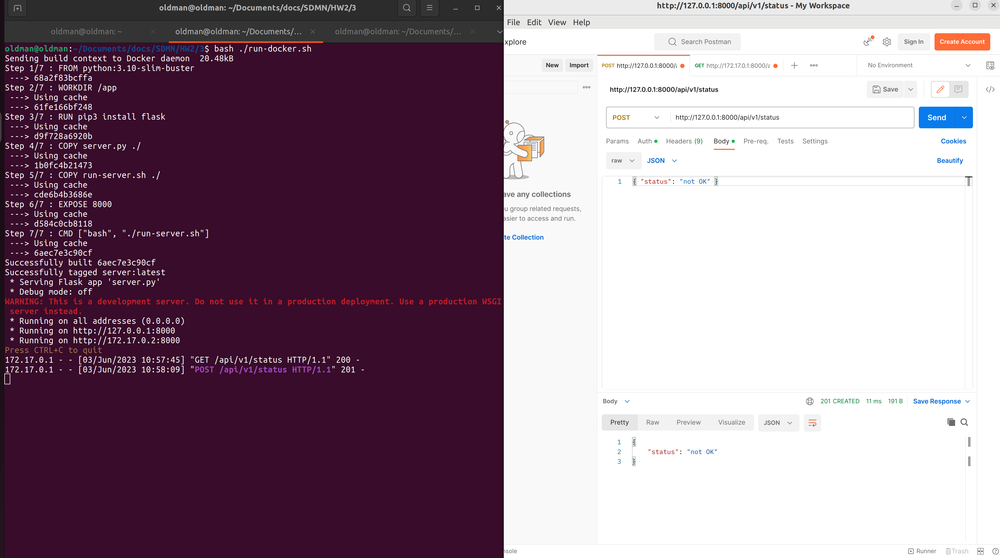

# Problem 3 (Docker)

This problem is about Docker. In this problem you write a simple HTTP server and dockerize it.

## Codes

This section contains two scripts listed below:
- `run-docker.sh`: Install container
- `docker/server.py`: Create http server
- `docker/run-server.sh`: Move to fs for starting server
- `docker/Dockerfile`: Docker 

### Implementation

* simply we can write a server with flask library

1. response to GET method:
```json
{ "status": "OK", "code": 200 }
```

2. response to POST method and body ``{ " status ": "not OK" }``
```json
{ "status": "not OK", "code": 201 }
```

3. build container
```
sudo docker build -t server ./docker
```

4. start container
```
sudo docker run -p 8000:8000 server
```

___

## Images and report

* Check `screenshots` to see all implementation step results.

<br>
</br>

- #### server is up


<br>
</br>

- #### send GET request to 127.0.0.1:8000/api/v1/status


<br>
</br>

- #### send POST request



<br>
</br>

- #### stop container (with random name "intelligent_shamir")


## Getting Started

run `create_container.sh` to create a container:
```bash
sudo bash ./run-docker.sh
```